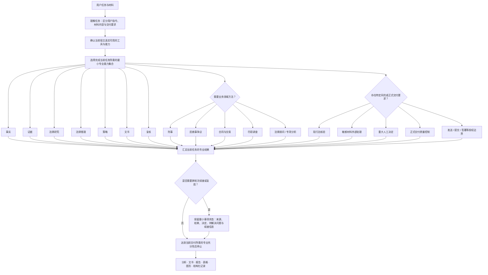

<!-- repo-header:start ｜ 仓库层，由 .github/scripts/apply_repo_layer.py 从 .github/repo-layer/README.header.md 生成；不要手改本段。下方二级标题起为作者 README 正文，逐字节保持作者原文。 -->
<p align="center">
  <a href="https://csslaw.cn/">
    <picture>
      <source media="(prefers-color-scheme: dark)" srcset="assets/brand/brand-mark-night.png">
      
    </picture>
  </a>
</p>

<h1 align="center">爽律 Skill｜律师专业工作流系统</h1>

<p align="center">
  <strong>中国律师实务的专业方法与质量控制层</strong>
</p>

<p align="center">
  让 AI Agent 按照律师的工作逻辑处理事实、证据、法律、策略与文书。
</p>

<p align="center">
  
  
  
  
  <a href="LICENSE"></a>
</p>

<p align="center">
  <strong>发起及主导：卓建律师事务所 蔡诗爽律师</strong><br>
  <a href="https://csslaw.cn/">爽律刑法空间 · csslaw.cn</a>
  ·
  <a href="docs/User_Guide/快速开始指南.md">快速开始</a>
  ·
  <a href="docs/User_Guide/爽律Skill使用指南.md">使用指南</a>
  ·
  <a href="LICENSE">许可</a>
  ·
  <a href="ACKNOWLEDGEMENTS.md">致谢</a>
</p>

---

<!-- repo-header:end -->

## 一、这是什么

**爽律 Skill｜律师专业工作流系统**是一套面向中国律师实务的 **Agent Skills 工作流系统**，也是为 AI Agent 提供律师专业方法与质量控制的能力层。

在支持 Agent Skills 自动发现的宿主中，用户可以直接提出法律任务，系统会根据任务语义判断是否需要激活爽律，并按当前任务选择所需的专业能力；在不支持自动发现的宿主中，也可以通过“调用爽律”“用爽律处理”“ShuangLaw”等方式显式使用。

它帮助 AI 按照律师处理专业工作的逻辑，理解任务，整理事实与证据，开展法律研究和推理，比较策略，处理法律文书，并在正式交付前完成必要复核。

爽律 Skill 的目标不是替律师“自动给答案”，而是把律师日常工作中应当完成的**事实与证据分析、法律研究、专业判断、策略比较、文书工作、质量控制、对抗性审查、风险提示和交付要求**，转化为 Agent 可以按需执行的工作流程，并通过事实状态、来源定位和正式交付检查，使重要结果能够复核和回查。

爽律面向的是律师真实工作。它不自带法律数据库、OCR、Office、PDF 或通用项目管理系统；需要这些能力时，由当前 Agent 或宿主实际可用的工具完成，爽律负责法律专业方法、质量要求和结果整合。

简而言之，爽律解决的不是“让 AI 多写一点”，而是让 AI 在处理法律任务时知道：**应该先理解什么、必须核验什么、何时继续深入、何时停止，以及怎样把内部专业工作转化为可以正式交付的成果。**

---

## 二、当前能力范围

| 技能 | 主要用途 |
|---|---|
| **法律研究与多源资料融合** | 现行法核验、法律与案例检索、地方规则、类案比较、裁判分歧和多源资料综合 |
| **刑事案件办理** | 会见、阅卷、事实与证据分析、罪名与构成、程序与阶段策略、辩护、被害人代理和刑事控告 |
| **民商事争议解决** | 请求与抗辩、争议焦点、证据与举证责任、管辖与时效、诉讼/仲裁策略、庭前与庭审准备 |
| **合同与交易工作** | 交易结构、履行流程、合同起草、审查、修改、谈判、签署与履行风险 |
| **法律顾问与专项法律分析** | 问题重构、事实基础、法律分析、方案比较、风险与机会、建议和行动计划 |
| **尽职调查与专项调查** | 调查范围、资料清单、多源核验、信息缺口、风险识别、补救措施与交易交接 |
| **法律文书质量与格式控制** | 文书起草与审改、结构、论证、语言、引用、格式、版本和正式交付前复核 |
| **材料输入适配** | 在宿主具备相应能力时，对 PDF、扫描件、图片、表格、音频、视频等材料进行可追溯处理 |

这些技能不是彼此孤立的。一个复杂法律事项可能以某个业务技能为主，同时按需要调用事实、证据、研究、推理、策略、文书、复核以及必要的风险控制能力。

其中，材料输入适配属于**依赖宿主的协同能力**，不代表爽律自身具备 OCR、音视频识别或 Office/PDF 编辑能力。法律顾问与专项法律分析当前主要支持有明确边界的专项问题处理，不等同于完整的长期法律顾问运营系统、CRM 或企业合规平台。

---

## 三、怎么使用

最简单的方式，是直接说明你要完成的法律任务。

例如：

- “分析这套刑事卷宗，先梳理事实、证据问题和辩护方向。”
- “审查并修改这份合同，我们代表甲方。”
- “研究这个问题，核验现行法、地方规则和相关案例。”
- “整理证据、提炼争点并形成代理意见。”
- “对这份法律意见做一轮对抗性审查。”
- “先把这批材料看懂，整理时间线、主体关系和核心问题。”
- “只统一这份文件的格式，不要改变正文内容。”

为了获得更稳定的结果，任务描述最好包含以下信息：

- **角色**：代表哪一方，或者以什么身份处理；
- **目标**：这次真正需要解决什么问题；
- **材料**：需要审阅哪些文件，以及是否存在缺件；
- **范围**：只处理格式、只做初步分析，还是需要完整研究；
- **交付物**：内部分析、清单、修改稿、正式文书、报告或其他成果；
- **限制**：期限、篇幅、模板、保密要求以及禁止执行的事项。

在支持自动发现的宿主中，用户通常不需要先说“调用爽律”。爽律也保留显式调用入口。

如宿主支持相应偏好，激活方式可以设置为：

- **AUTO**：符合任务语义时自动激活；
- **CONFIRM**：边界任务先确认；
- **MANUAL**：只在用户明确调用时使用。

无论采用哪一种方式，用户当前明确的任务指令都优先于长期激活偏好。

---

## 四、它怎样工作

v0.48 **不是每个任务固定跑一条完整流水线**。

它先判断用户真正要求什么，再选择完成当前任务所需的**最小必要能力集合**。简单任务不强制展开完整流程；只有当新的事实、证据、法律、风险、策略或交付要求会实质影响结果时，才继续加深。



这套机制有几个重要含义：

- **小任务走小流程，复杂任务才逐步加深。**
- 不因为材料很多，就自动把所有能力全部加载。
- 不因为文件名叫“法律意见书”或“合同”，就机械触发与用户要求无关的研究或分析。
- 已经形成且仍然有效的专业结果，优先复用，不无意义地重复计算。
- 复杂事项需要连续工作时，才保留最小必要的事项状态；爽律不因此变成案件数据库或 CRM。
- 达到当前任务所需的专业充分性后就停止，不为了流程完整制造额外工作。

---

## 五、重要风险提示

### 1. 敏感案件和敏感材料应优先脱敏

真实案件和客户材料可能包含个人信息、客户秘密、商业秘密、未公开侦查或诉讼材料以及其他敏感信息。

在将材料提供给第三方模型、OCR、语音转写、云盘、外部 API、法律数据库或其他外部服务前，应根据案件性质和使用环境判断风险。

**对敏感事项，原则上应先做必要脱敏，并遵循“最小必要”原则，只提供完成当前任务确实需要的内容。**

### 2. 工具可用，不等于已经取得材料外发授权

API Key、账号、连接器、数据库或其他工具能够调用，只说明技术上可用，不代表已经取得把当前案件或客户材料发送给第三方的授权。

涉及外部服务时，应确认：

- 将向谁发送；
- 发送哪些材料；
- 用于什么目的；
- 是否存在日志、缓存、留存或跨境等风险；
- 是否已经取得必要授权。

### 3. 爽律不能代替律师最终专业判断

爽律可以辅助完成材料整理、事实与证据分析、法律研究、方案比较、风险提示、文书起草、对抗性审查和质量控制。

但输出仍可能存在事实理解错误、信息遗漏、法律更新不及时、案例适用偏差、推理偏差、工具识别错误或 AI 幻觉。

**拟对外提交、签署、发送或据以作出重大决定的内容，应由具备相应专业能力的律师最终复核。**

### 4. 系统输出不当然构成正式法律意见

爽律形成的分析、清单、草稿、风险提示和研究结果，原则上属于专业工作辅助成果。

是否构成正式法律意见，应结合委托关系、材料完整程度、事实核验情况、研究充分程度、律师人工复核和正式签发程序另行判断。

### 5. 重要法律依据应核验当前有效性

法律、司法解释、规范性文件、监管规则和案例可能发生修改、废止、失效或适用范围变化。

涉及正式法律判断时，应根据任务需要核验：

- 当前有效文本；
- 生效、修改和失效时间；
- 过渡规则；
- 适用法域；
- 与案件行为发生时间的对应关系；
- 必要的省级、当地规则和程序规则。

如果本次任务没有实际完成现行法核验，就不能把结论标成“已核验现行有效”。

### 6. 默认面向中国大陆法律实务

爽律目前主要围绕中国大陆法律实务设计。

涉及香港、澳门、台湾地区、外国法、国际法或其他法域时，应重新确认适用法律体系、职业规则、案例效力和程序前提，不应直接套用中国大陆法律工作的默认假设。

---

## 六、事实、材料与来源状态不能混淆

爽律要求区分“收到了什么”“实际看了什么”“能够证明什么”和“目前只能推断什么”。

基本原则包括：

- `RECEIVED`（收到）不等于 `REVIEWED`（已经审阅）；
- 当事人陈述不自动等于已核验事实；
- 模型推断不自动升级为事实；
- OCR、转写或自动解析结果不自动等于原始文件无误；
- “没有找到”不等于“不存在”；
- 只审阅了部分页、部分文件或部分数据时，应明确范围；
- 重要事实应尽可能保留页码、段落、单元格、时间戳等来源定位。

对于多文件、多版本、多来源材料，可以按任务需要建立结构化审阅记录，用于比较时间、主体、金额、陈述、版本、证据冲突和信息缺口。

---

## 七、面对大量材料时，先把事情看懂

收到复杂卷宗、合同组、争议材料或尽调文件时，爽律可以先形成一个**事项快速理解结果**，帮助律师在深入分析前建立整体认识。

通常可以包括：

- 一句话说明这件事是什么；
- 关键主体、时间、金额与关系；
- 主要事实或交易模式；
- 3—7 个核心关注点；
- 重要矛盾、缺口与未知；
- 后续阅读导航。

当材料存在明显结构时，还可以根据需要形成：

- 时间线；
- 主体关系图；
- 交易结构图；
- 资金流；
- 履行流程图；
- 证据关系图或问题结构图。

这不是一个固定必跑模块。简单事项没有必要为了形式完整制造图表；图形也不能替代对决定性原始材料的核验。

---

## 八、法律研究与来源核验

法律研究不是“搜到一条就算”。

对于重要问题，爽律会根据任务需要继续判断：

- 当前适用哪个法域和时间节点；
- 规范是否现行有效；
- 是否存在特别规则、例外规则或地方规则；
- 原始权威来源在哪里；
- 支持案例与反向案例分别是什么；
- 类案真正相似的决定性事实是什么；
- 是否存在重大裁判分歧；
- 当前材料能够支持多强的结论。

重要结论应尽可能形成清晰的依据链：

```text
材料 / 权威来源
→ 精确来源定位
→ 事实与证据
→ 法律问题
→ 法律规则与案例
→ 分析与论证
→ 策略与结论
→ 正式交付
```

法律数据库、官方检索源、用户知识库、网页和其他搜索工具都可以用于发现材料，但“在哪里搜到”与“这个材料在当前法律问题中能承担什么作用”是两回事。

数据库片段不能冒充全文；知识库中的旧结论不能自动当作现行法律；服务商自带的“权威”“相关度”标签也不能直接代替法律效力、来源性质或类案可比性的专业判断。

---

## 九、人工判断与责任边界

爽律可以提供分析和建议，但以下事项原则上应由律师、客户或其他有权主体作出最终决定：

- 是否认罪、认罚；
- 是否起诉、撤诉、上诉；
- 是否放弃重要权利；
- 是否接受和解及核心和解条件；
- 是否签署重大合同；
- 是否承担重大商业风险；
- 是否确定重大交易立场；
- 是否向第三方提供敏感案件或客户材料；
- 其他可能产生重大法律后果的决定。

**专业判断完成，不等于已经取得对外行动授权。**

即使文书已经形成最终稿，也不等于系统可以自动替用户：

- 发送；
- 提交；
- 签署；
- 删除；
- 修改权威数据；
- 进行其他具有重要法律或外部效果的操作。

---

## 十、对抗性审查与正式交付

对抗性审查不是所有小任务都固定执行的重流程。

当用户明确要求挑战、复核、寻找弱点，或者正式成果的重要性和风险足以要求进一步检查时，爽律会根据需要审查：

- 有没有遗漏不利事实；
- 有没有反向证据；
- 有没有不同法律解释；
- 有没有更高权威或更新的来源；
- 对方最强的主张是什么；
- 有没有重要的反向案例或裁判分歧；
- 哪个事实或假设变化后会使结论翻转；
- 当前风险是否只是因为信息不足而被低估。

对于起诉状、答辩状、辩护意见、正式法律意见、合同定稿等正式交付物，还应检查：

- 重要内容是否有事实和来源支持；
- 未解决的不确定性是否被正确处理；
- 是否残留内部策略、工作底稿、TODO、占位符或 AI/工具执行痕迹；
- 是否把未经核验的假设写成了确定事实；
- 多份交付文件中的主体、日期、金额、请求、案号、附件编号是否一致；
- 声称生成的 DOCX、PDF、修订稿、批注、图形等实体文件是否真实存在且能够正常使用。

正式成果的清理不是“把不利内容删掉”，而是把真正需要对外披露的信息转换成有来源、确定性匹配、适合当前受众的表达。

---

## 十一、复杂事项的续接与结果复用

对于需要跨轮次、跨会话或多阶段继续处理的复杂事项，爽律可以按需要保留**最小专业连续性状态**。

它不是完整案件数据库，也不是 CRM 或通用项目管理系统。

需要续接时，可以保留：

- 来源索引；
- 已形成的专业结果；
- 已作出的人工决定状态；
- 尚未解决的问题；
- 下一步继续工作所需的最小续接信息；
- 成套交付物与共享事实字段的必要状态引用。

已经形成的结果只有在其关键依赖仍然有效时才能继续复用。新材料、新事实或新的法律结论改变上游依据时，只使受影响的下游结果进入待更新状态，不应无差别推翻全部工作。

如果当前宿主不具备持久化能力，爽律只能输出可携带的续接信息，不能声称已经长期保存。

---

## 十二、用户习惯、模板与版本升级

爽律的核心专业规则与用户自己的合法工作习惯、模板资产应当区分。

处理法律工作偏好和模板时，基本优先级是：

```text
硬性专业与安全边界
>
当前事项 / 用户本次明确要求
>
用户已经确认的法律工作偏好与模板
>
版本默认
```

因此：

- 不应因为升级新版而静默覆盖用户已经确认的合法工作习惯；
- 不应静默替换用户自己的 DOCX、Markdown 等模板；
- 当前任务明确指定的模板或风格，只影响其指定范围；
- 找不到用户模板时，不能声称“已按你的模板完成”；
- 旧模板可以提供结构、样式和表达参照，但不能把旧案件的事实、主体、金额、结论或旧法律版本复制进新事项；
- 用户偏好不能关闭事实真实性、现行法核验、来源追溯、敏感材料授权和重大人工决定等硬边界。

爽律只规定如何解析和使用这些偏好与模板，不自称拥有独立的长期记忆或文件存储能力。

---

## 十三、外部工具与材料输入

爽律负责法律专业方法，不把任何一家外部工具假装成自身固有能力。

当前 Agent 或宿主如果具备相应能力，可以配合使用：

- OCR 与扫描件识别；
- PDF / Office 文件处理；
- 图片、表格、音频、视频处理；
- 法律数据库；
- 官方网页和公开网络检索；
- 用户知识库；
- 电子表格或数据库能力；
- DOCX / PDF 等文件生成；
- 原生修订、批注或版本比较。

使用这些能力时，应尽量保留：

- 原始来源；
- 页码、区域、单元格、时间戳等定位；
- 处理方式；
- 读取范围；
- 质量状态；
- 降级或失败情况。

如果当前宿主不具备对应能力：

> **不能因为“理论上可以”就声称已经读取、检索、修改、生成、提交或发送。**

能用其他真实能力合理替代的，可以继续；只能降级处理的，应明确说明；核心正确性要求无法满足时，才应阻断。

---

## 十四、当前版本与能力边界

**当前版本：v0.48 正式版。**

v0.48 当前运行层采用：

> **轻量入口 + 按需共享能力 + 业务领域扩展 + 条件风险控制 + 最小事项状态 + 松耦合外部能力**

入口保持精简，专业方法在真正需要时才加载。

当前主要业务领域包括：

- 刑事案件办理；
- 民商事争议解决；
- 合同与交易工作；
- 尽职调查与专项调查；
- 法律顾问与专项法律分析。

需要特别说明：

- 当前主要面向中国大陆法律实务；
- 刑事、合同为较厚能力；
- 民商事争议解决、尽职调查为中厚能力；
- 法律顾问与专项分析目前以专项问题处理为主，不等同于完整长期法律顾问运营系统、CRM 或企业合规平台；
- 当前没有独立的行政诉讼业务 Domain；
- 当前没有独立的企业合规业务 Domain；
- OCR、法律数据库、Web、Office、PDF 与多模态能力取决于实际宿主环境。

v0.48 的精简原则是：

> **可以减少重复和不必要加载，但不能以降低专业能力、执行细节、领域深度或正式交付质量为代价。**

---

## 十五、文件入口、作者与许可

### 文件入口

- `runtime/shuanglv-legal-skills/SKILL.md`：Agent Skills 运行入口；
- `runtime/shuanglv-legal-skills/references/`：按需加载的专业方法、业务领域规则与风险控制；
- `docs/User_Guide/`：律师用户使用说明；
- `ACKNOWLEDGEMENTS.md`：完整致谢；
- `LICENSE`：当前版本许可。

### 使用指南

| 文档 | 用途 |
|---|---|
| [快速开始指南](docs/User_Guide/快速开始指南.md) | 第一次使用 |
| [爽律 Skill 使用指南](docs/User_Guide/爽律Skill使用指南.md) | 完整使用方式 |
| [Skill 能力地图](docs/User_Guide/Skill能力地图.md) | 查看当前能力与边界 |
| [各 Skill 使用说明](docs/User_Guide/各Skill使用说明/) | 按业务领域深入 |
| [输出质量控制指南](docs/User_Guide/输出质量控制指南.md) | 正式成果质量控制 |
| [安装与调用说明](docs/安装与调用说明.md) | 安装、调用与宿主适配 |

### 关于作者

**蔡诗爽**，卓建律师事务所专职律师，深圳刑事辩护律师，2017 年起执业，专注刑事控告与刑事案件全流程辩护，核心领域为诈骗类犯罪、商标类知识产权刑事犯罪、虚拟货币相关刑事犯罪、印章与国家机关证件类刑事犯罪；广东省刑事辩护律师库首批入库律师，深圳市律师协会数字经济法律专业委员会副秘书长；参与撰写《深圳律师实务丛书·元宇宙法律实务》（法律出版社）。

爽律 Skill 的系统设计、全部业务规则与工作流均由蔡律师完成，蔡律师亦是本仓库法律业务规则的终审人。个人主页[爽律刑法空间 · csslaw.cn](https://csslaw.cn/)收录了刑事观察文章、亲办案例节选与刑事实务工具（刑事程序地图、常见罪名速查），可作为理解本系统刑事工作流设计取向的延伸阅读。“爽律”既是本系统的调用简称，也是蔡律师的个人专业品牌。

### 品牌标识

`assets/brand/` 下的“爽律”品牌标识为蔡诗爽律师所有，**不在本仓库文本／代码许可范围之内**，仅用于标识本系统与作者；未经作者许可不得另作他用。

### 许可与反馈

v0.48 适用根目录 [LICENSE](LICENSE) 所载的 **ShuangLaw Professional Use License 1.0**。

项目处于持续完善阶段。真实使用中如发现工作流程、专业规则、兼容性、风险控制或使用体验方面的问题，可通过：

- [开放反馈说明](docs/开放反馈说明.md)
- [CONTRIBUTING](CONTRIBUTING.md)

提交反馈。

---

## 十六、致谢

爽律 Skill 的形成和持续改进，既来自律师实务经验，也来自真实使用中的失败、反馈、问题发现和公开社区的启发。

特别感谢 **方冬律师、古鉴璇律师、徐博瀚律师**，以及 GitHub 社区贡献者 **doctorllll** 对仓库整理、合同与文书质量、执行效率、Agent Skills discovery 兼容性等方面提供的协助、反馈或问题发现。具体贡献记录见 [ACKNOWLEDGEMENTS｜致谢](ACKNOWLEDGEMENTS.md)。

同时感谢 **Anthropic / Agent Skills** 的公开规范与实践，以及 **THUYRan / Legal-Skills-Chinese** 等公开项目为法律 Skill 工程化提供的对照与启发。

被列入致谢、参考或贡献记录，不表示相关个人、机构或项目参与了爽律全部开发，也不表示其认可、推荐、背书本项目或对本项目输出承担责任。

---

<p align="center">
  <strong>爽律 Skill｜律师专业工作流系统</strong><br>
  <sub>把律师专业工作的关键步骤，转化为 AI Agent 可以按需执行、复核和衔接的工作流程。</sub>
</p>

<!-- repo-appendix:start ｜ 仓库层，由 .github/scripts/apply_repo_layer.py 生成；不要手改本段。以上为作者 README 正文。 -->

---

## 附：仓库层说明

本仓库的 v0.48 正式运行层位于 `runtime/shuanglv-legal-skills/`。安装时应将仓库作为整体提供给 Agent，并以该目录下的 `SKILL.md` 作为运行入口。

### 目录结构

```text
.
├── runtime/shuanglv-legal-skills/  # 唯一正式运行层
├── docs/                           # 用户指南、安装、反馈与许可说明
├── assets/bootstrap/               # 不含真实用户数据的初始化示例
├── assets/brand/                   # 爽律品牌资源，不在许可证授权范围内
├── PACKAGE_MANIFEST.json           # 正式成果包清单
└── .github/                        # 仓库治理、模板与维护脚本
```

### 安装

```bash
git clone https://github.com/zj-ai-lab/shuanglv-legal-skills.git
```

宿主应读取 `runtime/shuanglv-legal-skills/SKILL.md`，并按需访问同目录的 `references/`。`docs/`、开发包和测试材料不得作为 Runtime 常驻指令加载。

### 版本与历史

当前 `main` 为 v0.48 正式架构。v0.43 及更早版本保留在 Git tag 和历史提交中，可通过对应 tag 下载。

### 许可

v0.48 适用根目录 `LICENSE` 所载的 **ShuangLaw Professional Use License 1.0**。`assets/brand/` 品牌标识另受权利人控制。

<!-- repo-appendix:end -->
